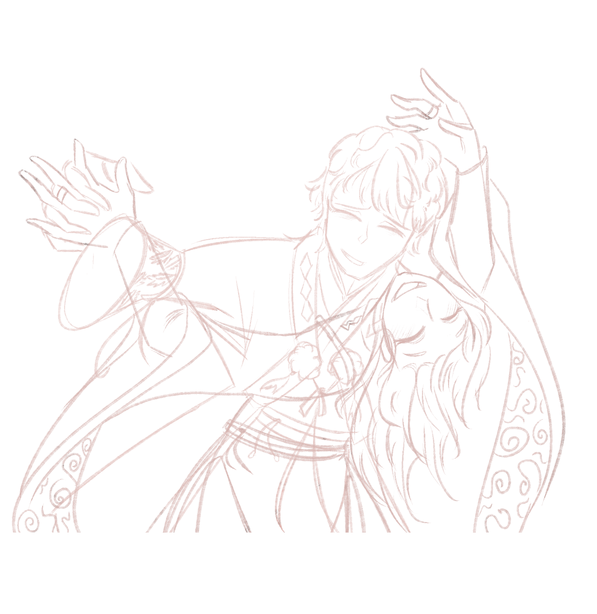

# ❣️KIZUNA LETTER❣️

  

  <i>A little world made for someone very special.</i>

## To the person this was made for

There are some things that are difficult to give to someone.

Not because they are impossible to find, but because they cannot really be bought.

Time.

Memories.

A song that suddenly reminds you of them.

A drawing made with your own hands.

Words that you kept inside because they were too important to say casually.

And the feeling of looking at someone and thinking:

**I am grateful that, among all the people in this world, I found you.**

Kizuna Letter was created because I wanted to give you something made from all of those things.

Something that could exist because of our story.

Something that could not have been made for anyone else in exactly the same way.

So I decided to turn a letter into a little world.

---

## Why I made this

Kizuna Letter was, above everything else, a gift.

A very personal one.

I wanted to create a place where I could collect some of the things that remind me of you: words, music, memories, drawings, little details, and the amount of time we have shared together.

I wanted to make something that could say:

**I remember.**

**I appreciate you.**

**I love you.**

And, perhaps most importantly:

**Thank you for being part of my life.**

There are people who pass through our lives and leave memories behind.

And then there are people who become part of the way we understand the world.

You are one of those people for me.

That is what I wanted this project to hold.

---

## A bond made of time

The name **Kizuna (絆)** carries the idea of a bond that connects people.

I chose it because I like the thought that some connections are not defined by a single moment.

They are built slowly.

Through years.

Through ordinary days and extraordinary ones.

Through growing up, changing, learning, making mistakes, laughing, dreaming, and continuing to find your way back to each other.

There is something beautiful about that kind of bond.

It reminds me of one of the ideas I love most in stories such as *Heaven Official's Blessing*: that time does not necessarily make a meaningful connection disappear.

Sometimes, it gives that connection more meaning.

I wanted Kizuna Letter to carry a little of that feeling.

Not a promise that everything will always be perfect.

But a small reminder of the beauty of having someone whose presence became part of your journey.

---

## To the person who inspired this

I admire you.

Not only for the things you can do, but for the person behind them.

For your mind.

For the way you think.

For the things you dream about.

For the parts of yourself that you are still discovering.

For the person you are becoming.

One of the reasons I wanted to make this project was because I wanted to create something that could reflect how much I value those things.

And maybe that is why this project became so much more than a website to me.

It became a way of saying something that I could never fully express with a simple message:

**I see you.**

**I appreciate you.**

**And I am grateful that I get to witness your journey.**

---

## I made this with my own hands

There is another reason why this project means so much to me.

I did not want to simply find something beautiful and give it to you.

I wanted to **make** something beautiful for you.

So I used the things I am learning.

I wrote the code.

I designed the experience.

I created the illustrations.

I wrote the words.

I chose the music.

I thought about the colors, the atmosphere, the little interactions, and all the details that could make the experience feel like something alive.

Some parts were easier than others.

Some parts made me stop and learn.

Some parts made me make mistakes and try again.

And honestly, I think that makes the project even more meaningful.

Because it is not only something I made for you.

It is also something I learned to make **because I wanted to give you something special.**

---

## What this project taught me

Kizuna Letter was also a very important step in my learning as a programmer.

I wanted to build this project by myself and, more importantly, **understand what I was writing**.

Rather than simply putting together code that worked, I wanted to understand why it worked.

Through this project, I had the opportunity to practice and strengthen my knowledge of **Java, HTML, and CSS**, working with them together inside a monolithic application.

It allowed me to take concepts I had been learning separately and turn them into something real.

I learned by building.

I made mistakes.

I searched for solutions.

I changed things.

I broke things.

I fixed them again.

And little by little, I began to understand my own code better.

That is something I will always associate with this project.

I did not only create a digital letter.

I created something that helped me become a better programmer.

---

## And then there is the art

The artwork in Kizuna Letter was created by me.

Every illustration, every visual decision, and every little artistic detail was made with affection and with this project in mind.

I wanted the visual identity to feel soft, intimate, and slightly nostalgic.

The flowers.

The night atmosphere.

The colors.

The delicate details.

The Japanese and Chinese-inspired elements that I love.

I did not want the art to simply decorate the website.

I wanted it to feel like another part of the letter.

Because sometimes there are things that words cannot say.

And sometimes a drawing can say them quietly.

Every original illustration included here was made by me, with care and with this project in mind.

Because of that, the artwork is part of the personal meaning of Kizuna Letter and belongs to me.

---

## Thank you

If I had to reduce this entire project to one idea, it would probably be this:

**thank you.**

Thank you for being part of my life.

Thank you for the memories.

Thank you for the conversations, the laughter, the difficult moments, the ordinary days, and all the little things that become meaningful simply because they were shared.

Thank you for being someone I can admire.

Thank you for inspiring me to keep learning and creating.

And thank you for giving me another reason to look forward to all the things that are still waiting for us in the future.

Maybe this little website cannot contain everything I feel.

But it can contain a piece of it.

And that piece is here.

---

## A little note

This project may look like a small website.

Technically, it is.

But behind the code there is a much bigger reason why it exists.

It was made during a particular moment in my life, for a particular person, with all the little things that make our story ours.

Maybe that is one of my favorite things about programming:

**you can turn an idea that only existed in your head into something another person can actually see.**

And sometimes, you can turn a feeling into a place.

That is what Kizuna Letter became for me.

A place where I could leave a little piece of my gratitude, my creativity, and my love.

---

## A final word

To the person who inspired every part of this:

I hope that, whenever you come back to this little place, you remember that it was made slowly, carefully, and with a lot of love.

Every line of code was part of the process.

Every drawing was made by hand.

Every word was chosen because it reminded me of you.

And every little detail exists because, at some point, I thought:

**“I want to make this for you.”**

That was enough of a reason to begin.

And it will always be the reason Kizuna Letter exists.

**Made with code, art, memories, and love.**

♡ 🌸 ♡

  <i>For one very special person.</i>

